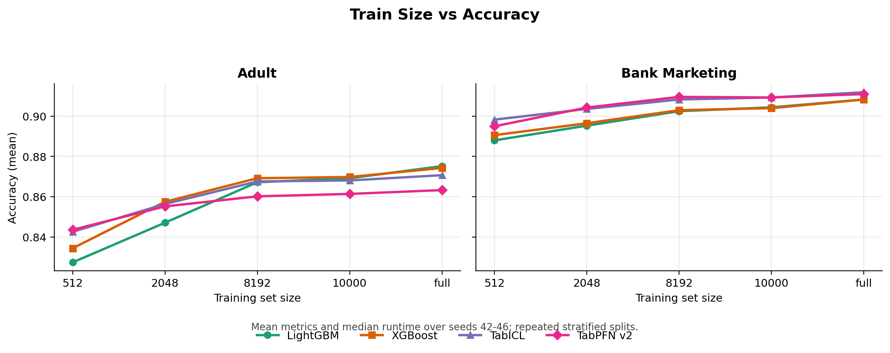
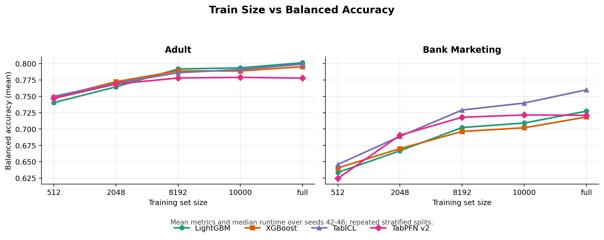
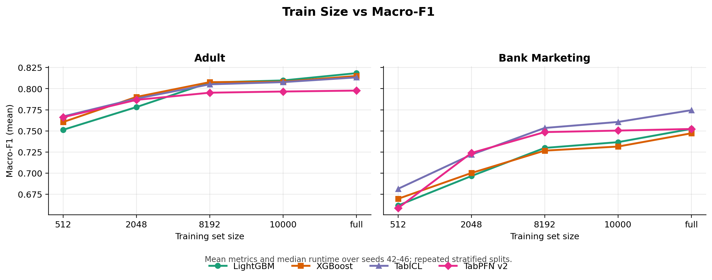
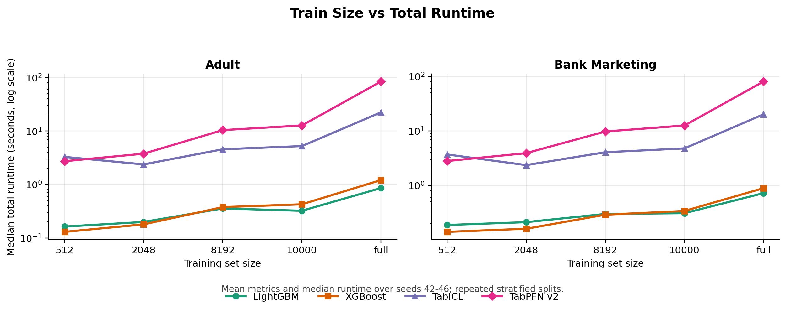
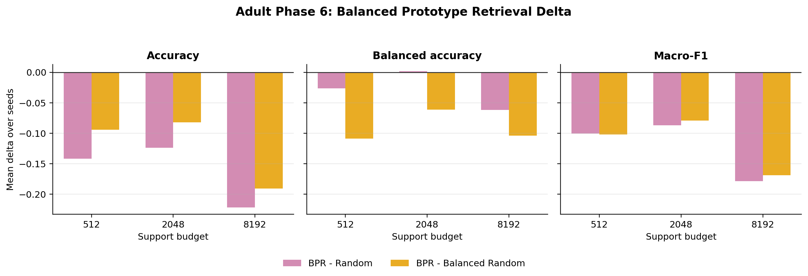

# Comparing Tabular Foundation Models and Boosted-Tree Baselines on Small-to-Medium Classification Tasks

## Abstract

This project compares two tabular foundation models, TabPFN v2 and TabICL, with two strong boosted-tree baselines, LightGBM and XGBoost, on two OpenML classification datasets: Adult and Bank Marketing. The evaluation uses repeated stratified splits and reports accuracy, balanced accuracy, macro-F1, and practical runtime. The mainline results show that boosted-tree baselines remain strongest on Adult, while foundation models, especially TabICL, are more competitive on Bank Marketing. Runtime results reveal a large practical cost gap: tree models are much faster, TabICL is substantially faster than TabPFN v2, and foundation-model runtime grows with train size.

As a Big Plus extension, the project also studies TabICL support-set selection on Adult. Three budget-limited support-set strategies are compared with a full-context reference. The frozen balanced prototype retrieval strategy does not outperform random subset or balanced random subset, but budget-limited support sets substantially reduce TabICL fit+predict runtime. The Big Plus result is therefore best interpreted as a useful negative ablation: support-set compression is practically useful, but the current class-center prototype retrieval rule is not a performance-improving method.

## Introduction

Tabular data remains central in applied machine learning, including finance, marketing, healthcare, and operations. Boosted-tree methods are still strong default choices for tabular prediction, while tabular foundation models promise broader reuse and lower task-specific modeling effort. This project asks a practical question: under controlled local experiments, when do tabular foundation models look better than boosted-tree baselines, and what do they cost?

The main project scope is classification on small-to-medium tabular datasets. Regression and survival analysis are intentionally out of scope. The main comparison includes four models: LightGBM, XGBoost, TabPFN v2, and TabICL. The main datasets are Adult and Bank Marketing. The report focuses on three predictive metrics, accuracy, balanced accuracy, and macro-F1, plus runtime.

The project also includes a small Big Plus extension around TabICL. Because TabICL uses support examples as context, support-set selection is a contained way to study whether better context construction can improve the metric/runtime tradeoff. The extension is kept separate from the mainline comparison so that the report remains valid even if the Big Plus method does not improve performance.

The research questions are:

- Which model family performs best on Adult and Bank Marketing?
- How do accuracy, balanced accuracy, and macro-F1 change with train size?
- How does practical runtime scale with train size?
- Is TabICL a useful foundation-model target for a small method extension?
- Can TabICL support-set selection improve the metric/runtime tradeoff?

## Related Work / Background

Boosted-tree models are widely used for tabular learning because they handle heterogeneous features well, train quickly, and often perform strongly with limited tuning. In this project, LightGBM and XGBoost are fixed strong baselines rather than tuned state-of-the-art baselines. They provide practical comparison points for judging whether foundation models are worth their extra cost.

Tabular foundation models aim to reuse learned structure across tabular prediction tasks. TabPFN v2 is a prior-data-fitted model for tabular prediction. TabICL frames tabular prediction in an in-context learning style, making the choice of support examples especially relevant. These foundation models are evaluated as practical local tools rather than as benchmark winners on external suites.

Accuracy is easy to understand but can hide minority-class behavior. This is especially important for Bank Marketing, where class imbalance makes accuracy alone insufficient. Balanced accuracy and macro-F1 are therefore included as complementary metrics. Runtime is also part of the evaluation because a model that is accurate but too slow may be difficult to use in practice.

This project does not use TALENT, TabArena, or any other external tabular benchmark suite. All reported experiments are local experiments on the selected OpenML datasets, so Adult and Bank Marketing should be read as a lightweight benchmark subset rather than as suite-level benchmark coverage.

## Datasets

The project uses two OpenML classification datasets.

Adult is a binary income classification dataset with 48,842 samples, 14 raw features, 6 numeric features, and 8 categorical features. It mixes numeric and categorical columns and includes missing values. The data loader normalizes common string missing tokens such as `?`, `NA`, and `null` to missing values before model-specific preprocessing. In the main results, Adult tends to favor boosted-tree baselines, although TabICL is close to the strongest tree models.

Bank Marketing is a binary classification dataset with stronger class imbalance. It tests whether balanced accuracy and macro-F1 tell a different story from accuracy. Its `unknown` category values are kept as observed category levels rather than normalized as missing values. In the main results, foundation models are more competitive on this dataset, and TabICL has the strongest imbalance-aware metrics.

The experiments use repeated stratified splits. Within each seed, all models share the same train/test split. Across seeds, the test set changes; the results are repeated splits rather than one single fixed test set reused for every seed. The mainline uses seeds 42, 43, 44, 45, and 46. The Phase 6 Big Plus Adult experiment uses seeds 42, 43, and 44.

## Methods / Models

LightGBM is used as a fast boosted-tree baseline. It is strong on Adult and remains efficient across train sizes.

XGBoost is used as a second boosted-tree baseline. It is also fast and strong, with the highest Adult control-10k accuracy in the mainline results, although not the highest value on every metric.

TabPFN v2 is used as a tabular foundation-model baseline. It is competitive in some small-train-size settings, but it is slower than tree models and slower than TabICL. Full-train TabPFN v2 rows are treated as constrained reference results because they exceed the cleaner 10k support-range setting used for the main controlled comparison.

TabICL is the second tabular foundation model. It is close to tree models on Adult and strongest on Bank Marketing imbalance-aware metrics. It is also much faster than TabPFN v2 in this local setup, making it the natural target for the Big Plus support-set selection ablation.

## Experimental Setup

The mainline comparison evaluates LightGBM, XGBoost, TabPFN v2, and TabICL on Adult and Bank Marketing. Two main scenarios are used:

- `control_10k`: a controlled comparison using 10,000 training examples.
- `full_train_reference`: an engineering reference using the full available training split.

The scalability analysis evaluates train sizes 512, 2048, 8192, 10000, and full. Mainline means and standard deviations are computed over seeds 42, 43, 44, 45, and 46.

The metrics are:

- Accuracy.
- Balanced accuracy.
- Macro-F1.
- Fit seconds, predict seconds, and total seconds.

Runtime values are practical mixed-device timings. Tree models run on CPU, while foundation models may use CUDA. Runtime should therefore be interpreted as practical local cost rather than as a strict same-device hardware benchmark.

### Timing Protocol and Hardware

The submitted artifacts were generated in WSL Ubuntu with Python 3.12.3 on an AMD Ryzen 7 8845H CPU and an NVIDIA GeForce RTX 4060 Laptop GPU. The key package snapshot was NumPy 2.4.4, pandas 3.0.2, scikit-learn 1.8.0, LightGBM 4.6.0, XGBoost 3.2.0, PyTorch 2.11.0, TabPFN 7.1.1, and TabICL 2.1.0.

The timing scope is script-level practical timing around each model's fit and predict calls. For LightGBM and XGBoost, preprocessing is inside the scikit-learn pipeline and is included in fit/predict timing. For TabPFN v2, the external median-imputation and ordinal-encoding preparation happens before the measured model fit call, while model fit and predict are timed. For TabICL, the model fit and predict calls include its internal tabular transformation work. Model object construction, package import time, CSV loading, OpenML cache reads, and report rendering are not included in the model runtime columns.

The TabICL checkpoint is explicitly made available before the main loop so that checkpoint download or first-load setup does not pollute per-run timing. No separate same-device warm-up, memory benchmark, or CPU-only/GPU-only normalization protocol was applied. Runtime medians should therefore be interpreted as practical local execution costs under this environment, not as hardware-normalized speed rankings.

LightGBM and XGBoost are fixed strong baselines. They are not tuned state-of-the-art baselines. This choice keeps the project focused on a controlled course-project comparison rather than hyperparameter search.

As a supplemental robustness check, the project also runs an Adult-only missingness stress test at train size 2048 and seed 42. It injects deterministic cell-level missing values into feature columns at rates 0%, 10%, and 30%, while keeping the target labels unchanged and using the same masked split for all four models. This check is intentionally small and should not be interpreted as a full missing-value or categorical-cardinality robustness benchmark.

## Main Results

Table 1 summarizes the mainline model comparison. On Adult, boosted-tree models remain strongest overall. In the `control_10k` scenario, XGBoost has the highest accuracy mean at 0.8698, while LightGBM has the strongest balanced accuracy and macro-F1. TabICL is close to the tree baselines but does not clearly outperform them. TabPFN v2 is lower on the main metrics and slower than both tree models and TabICL.

On Bank Marketing, foundation models are more competitive. In the `control_10k` scenario, TabICL and TabPFN v2 tie on accuracy mean at 0.9093, but TabICL is stronger on balanced accuracy and macro-F1. In the `full_train_reference` scenario, TabICL has the best accuracy, balanced accuracy, and macro-F1. Tree models remain much faster, but they do not lead the predictive metrics on this dataset.

Metric columns in Table 1 are means over five repeated stratified splits, and the runtime column is the median total runtime over the same seeds.

**Table 1. Mainline model comparison on Adult and Bank Marketing.**

| Dataset | Scenario | Model | Accuracy | Balanced Accuracy | Macro-F1 | Median Total Seconds |
| --- | --- | --- | ---: | ---: | ---: | ---: |
| Adult | control_10k | LightGBM | 0.8692 | 0.7934 | 0.8097 | 0.3147 |
| Adult | control_10k | TabICL | 0.8681 | 0.7909 | 0.8077 | 5.0990 |
| Adult | control_10k | TabPFN v2 | 0.8614 | 0.7789 | 0.7966 | 13.1286 |
| Adult | control_10k | XGBoost | 0.8698 | 0.7887 | 0.8082 | 0.4186 |
| Adult | full_train_reference | LightGBM | 0.8752 | 0.8013 | 0.8183 | 0.8489 |
| Adult | full_train_reference | TabICL | 0.8707 | 0.7991 | 0.8133 | 29.7518 |
| Adult | full_train_reference | TabPFN v2 | 0.8633 | 0.7778 | 0.7977 | 83.1503 |
| Adult | full_train_reference | XGBoost | 0.8743 | 0.7953 | 0.8150 | 1.2288 |
| Bank Marketing | control_10k | LightGBM | 0.9044 | 0.7092 | 0.7367 | 0.3133 |
| Bank Marketing | control_10k | TabICL | 0.9093 | 0.7397 | 0.7606 | 5.0556 |
| Bank Marketing | control_10k | TabPFN v2 | 0.9093 | 0.7215 | 0.7504 | 13.1897 |
| Bank Marketing | control_10k | XGBoost | 0.9040 | 0.7019 | 0.7315 | 0.3425 |
| Bank Marketing | full_train_reference | LightGBM | 0.9083 | 0.7273 | 0.7524 | 0.7239 |
| Bank Marketing | full_train_reference | TabICL | 0.9119 | 0.7599 | 0.7745 | 20.6253 |
| Bank Marketing | full_train_reference | TabPFN v2 | 0.9110 | 0.7209 | 0.7523 | 80.1081 |
| Bank Marketing | full_train_reference | XGBoost | 0.9083 | 0.7184 | 0.7472 | 0.8925 |

The main interpretation is dataset-dependent. Adult favors boosted trees, while Bank Marketing gives foundation models, especially TabICL, a clearer advantage on imbalance-aware metrics. The runtime column also shows that foundation-model gains, where they appear, come with a substantial practical cost compared with LightGBM and XGBoost.

## Scalability Analysis

The scalability analysis studies how metrics change as the training size increases from 512 to full training data. Figures 1 to 3 show the three predictive metrics over the train-size grid.

**Figure 1. Train size vs accuracy.** Mean accuracy over seeds 42 to 46 for Adult and Bank Marketing. Larger training sets generally improve accuracy, with tree baselines remaining strongest on Adult and TabICL becoming more competitive on Bank Marketing. Error bars are omitted in the plot; standard deviations are available in the summary CSV.

**Figure 2. Train size vs balanced accuracy.** Mean balanced accuracy over seeds 42 to 46. This metric highlights minority-class behavior, especially on Bank Marketing, where TabICL benefits more clearly from larger train sizes than accuracy alone suggests. Error bars are omitted in the plot; standard deviations are available in the summary CSV.

**Figure 3. Train size vs macro-F1.** Mean macro-F1 over seeds 42 to 46. Macro-F1 confirms the dataset-dependent pattern: Adult remains favorable to boosted trees, while Bank Marketing gives TabICL the strongest full-train imbalance-aware result. Error bars are omitted in the plot; standard deviations are available in the summary CSV.

On Adult, larger train sizes generally improve all models, but tree models benefit more clearly. LightGBM macro-F1 rises from 0.7513 at 512 examples to 0.8183 at full training size. TabICL also improves and remains close to the strongest baselines, but it does not overtake them. TabPFN v2 improves less on Adult and remains below the strongest models.

On Bank Marketing, larger train sizes improve balanced accuracy and macro-F1 for all models. TabICL reaches the strongest full-train macro-F1 at 0.7745. This dataset is the clearest example of why accuracy is not enough: models can be close in accuracy while differing more substantially in balanced accuracy and macro-F1.

Selected scalability anchors are shown in Table 2. The table keeps only the 512 and full settings so that endpoint changes are easy to read; Figures 1 to 3 show the full train-size curves.

**Table 2. Selected train-size scalability anchors.**

| Dataset | Train Size | Model | Accuracy | Balanced Accuracy | Macro-F1 | Median Total Seconds |
| --- | --- | --- | ---: | ---: | ---: | ---: |
| Adult | 512 | LightGBM | 0.8274 | 0.7403 | 0.7513 | 0.1629 |
| Adult | 512 | TabICL | 0.8426 | 0.7499 | 0.7671 | 3.2788 |
| Adult | 512 | TabPFN v2 | 0.8436 | 0.7468 | 0.7662 | 2.7220 |
| Adult | 512 | XGBoost | 0.8344 | 0.7485 | 0.7605 | 0.1297 |
| Adult | full | LightGBM | 0.8752 | 0.8013 | 0.8183 | 0.8572 |
| Adult | full | TabICL | 0.8707 | 0.7991 | 0.8133 | 22.3303 |
| Adult | full | TabPFN v2 | 0.8633 | 0.7778 | 0.7977 | 84.1770 |
| Adult | full | XGBoost | 0.8743 | 0.7953 | 0.8150 | 1.2079 |
| Bank Marketing | 512 | LightGBM | 0.8880 | 0.6336 | 0.6618 | 0.1872 |
| Bank Marketing | 512 | TabICL | 0.8983 | 0.6458 | 0.6815 | 3.6889 |
| Bank Marketing | 512 | TabPFN v2 | 0.8950 | 0.6246 | 0.6587 | 2.7932 |
| Bank Marketing | 512 | XGBoost | 0.8906 | 0.6405 | 0.6697 | 0.1399 |
| Bank Marketing | full | LightGBM | 0.9083 | 0.7273 | 0.7524 | 0.7195 |
| Bank Marketing | full | TabICL | 0.9119 | 0.7599 | 0.7745 | 20.1147 |
| Bank Marketing | full | TabPFN v2 | 0.9110 | 0.7209 | 0.7523 | 80.3920 |
| Bank Marketing | full | XGBoost | 0.9083 | 0.7184 | 0.7472 | 0.8875 |

The endpoint view supports two conclusions. First, additional training data usually helps predictive metrics. Second, the runtime increase is model-dependent: tree models remain inexpensive, while foundation models become much more costly.

## Runtime Analysis

Runtime is a central practical tradeoff in this project. Figure 4 summarizes median total runtime over the train-size grid.

Table 1 and the scalability analysis are generated from separate experiment outputs. Table 1 uses the Phase 4 mainline output, while Table 2 and Figure 4 use the Phase 5 scalability output. Predictive metrics are directly comparable across the shared split protocol, while runtime medians should be read as practical local timings that can vary across independent reruns, especially for GPU-backed foundation-model runs.

**Figure 4. Train size vs median total runtime.** Median total runtime over seeds 42 to 46, plotted on a log scale. Tree models stay near sub-second to one-second runtime, TabICL is slower but still much faster than TabPFN v2, and TabPFN v2 becomes the most expensive model at larger train sizes.

Tree models are consistently fast. In the mainline summary, LightGBM and XGBoost stay around sub-second to roughly one-second runtime even at full training size. This makes them very strong practical baselines.

TabPFN v2 is much slower. At full train size, its median total runtime is about 84.1770 seconds on Adult and 80.3920 seconds on Bank Marketing in the scalability results. These rows are useful engineering references, but they should be interpreted with the support-range caveat.

TabICL is also slower than tree models, but it is much faster than TabPFN v2. At full train size, TabICL has median total runtime of about 22.3303 seconds on Adult and 20.1147 seconds on Bank Marketing in the scalability results. This makes TabICL the better candidate for the Big Plus extension: it has competitive metrics, especially on Bank Marketing, while remaining more practical than TabPFN v2.

Because these timings are practical mixed-device timings, they should not be presented as strict hardware-normalized speed comparisons. They are still useful for answering a course-project question: what does each model cost in this local setup?

## Big Plus: TabICL Support-Set Selection

The Big Plus extension focuses on TabICL support-set selection on Adult. The motivation is simple: because TabICL uses support examples as context, choosing a smaller or more representative support set might improve efficiency, performance, or both.

The Phase 6 experiment is Adult-only and uses seeds 42, 43, and 44. It compares four support-set strategies:

- Full Context: use the full seed-specific training split as a budget-independent reference.
- Random Subset: sample the requested budget uniformly without replacement.
- Balanced Random Subset: allocate the support budget by class quota, then sample randomly within class.
- Balanced Prototype Retrieval: use the same class quotas as balanced random, but select samples closest to the class center in a train-only retrieval space.

The budget-limited support sizes are 512, 2048, and 8192. Full Context uses 39,073 support examples. The retrieval space for Balanced Prototype Retrieval is constructed only from the training split. It uses train-split numeric imputation and scaling, train-split categorical imputation and one-hot encoding, and Euclidean distance to class centers. The method definition was frozen before the main Adult experiment, so the results are evaluated as an ablation rather than as a tuned method search.

Figure 5 directly compares BPR with the two budget-fair random baselines. Negative bars mean BPR is worse than the comparator.

**Figure 5. Balanced Prototype Retrieval delta against random baselines.** Mean metric deltas over seeds 42, 43, and 44. The frozen BPR strategy is mostly negative relative to both Random Subset and Balanced Random Subset. The only positive cell is a very small balanced-accuracy delta against Random Subset at budget 2048.

Supporting Phase 6 figures are also available for metric-by-budget and runtime views:

- `results/figures/phase6_big_plus_adult_accuracy.png`
- `results/figures/phase6_big_plus_adult_balanced_accuracy.png`
- `results/figures/phase6_big_plus_adult_macro_f1.png`
- `results/figures/phase6_big_plus_adult_total_seconds_median.png`

Table 3 gives the corresponding Phase 6 summary values. Metrics are means over three seeds. Runtime is split into median TabICL fit+predict time after support-set construction, median support-selection time, and median end-to-end time.

**Table 3. Phase 6 Adult support-set selection results.**

| Strategy | Budget | Accuracy | Balanced Accuracy | Macro-F1 | Median Fit+Predict Seconds | Median Selection Seconds | Median End-to-End Seconds |
| --- | ---: | ---: | ---: | ---: | ---: | ---: | ---: |
| Full Context | full | 0.8722 | 0.7919 | 0.8117 | 28.7849 | 0.0002 | 28.7851 |
| Random Subset | 512 | 0.8438 | 0.7358 | 0.7592 | 3.0325 | 0.0009 | 3.0334 |
| Random Subset | 2048 | 0.8573 | 0.7668 | 0.7873 | 2.2889 | 0.0017 | 2.2910 |
| Random Subset | 8192 | 0.8654 | 0.7874 | 0.8038 | 3.9785 | 0.0030 | 3.9818 |
| Balanced Random Subset | 512 | 0.7964 | 0.8180 | 0.7610 | 2.9976 | 0.0029 | 3.0097 |
| Balanced Random Subset | 2048 | 0.8155 | 0.8295 | 0.7792 | 2.1456 | 0.0031 | 2.1487 |
| Balanced Random Subset | 8192 | 0.8344 | 0.8293 | 0.7941 | 3.9814 | 0.0052 | 3.9869 |
| Balanced Prototype Retrieval | 512 | 0.7021 | 0.7093 | 0.6588 | 2.7719 | 0.1850 | 2.9569 |
| Balanced Prototype Retrieval | 2048 | 0.7336 | 0.7684 | 0.7002 | 2.0001 | 0.1848 | 2.1781 |
| Balanced Prototype Retrieval | 8192 | 0.6437 | 0.7256 | 0.6253 | 4.0640 | 0.1869 | 4.2452 |

The result is a negative ablation for the frozen Balanced Prototype Retrieval method. It does not outperform Random Subset or Balanced Random Subset. Balanced Random Subset is better than BPR on every metric and every budget. Relative to Random Subset, BPR has only one very small positive balanced-accuracy delta at budget 2048, and it remains clearly lower in accuracy and macro-F1.

The runtime result is still useful, but its definition is important. The fit+predict column measures TabICL model time after the support set has been constructed. The selection and end-to-end columns include the support-set construction step recorded by the current script. Under the model-side timing definition, Full Context has a median of 28.7849 seconds, while budget-limited strategies are roughly in the 2.0 to 4.1 second range. BPR adds about 0.185 seconds of median selection overhead in this implementation. Support-set compression can therefore make TabICL execution much faster, but the BPR selection rule still does not turn that efficiency gain into a predictive-performance gain.

The correct conclusion is not that Big Plus "succeeds." The more careful conclusion is that support-set compression has practical value, and that Balanced Random Subset is a strong baseline that any future retrieval method must beat.

## Supplemental Missingness Robustness Check

To address missing-value robustness more directly, the project includes a small Adult-only stress test with train size 2048 and seed 42. For each missingness rate, deterministic masks were applied to both train and test feature cells, and all four models used the same masked split. Table 4 reports the resulting metrics and drops relative to the 0% injected-missingness baseline.

**Table 4. Adult missingness robustness check at train size 2048, seed 42.**

| Missing Rate | Model | Accuracy | Accuracy Drop | Balanced Accuracy | Balanced Accuracy Drop | Macro-F1 | Macro-F1 Drop |
| ---: | --- | ---: | ---: | ---: | ---: | ---: | ---: |
| 0.0 | LightGBM | 0.8508 | 0.0000 | 0.7692 | 0.0000 | 0.7835 | 0.0000 |
| 0.0 | XGBoost | 0.8603 | 0.0000 | 0.7793 | 0.0000 | 0.7959 | 0.0000 |
| 0.0 | TabPFN v2 | 0.8552 | 0.0000 | 0.7707 | 0.0000 | 0.7876 | 0.0000 |
| 0.0 | TabICL | 0.8556 | 0.0000 | 0.7673 | 0.0000 | 0.7863 | 0.0000 |
| 0.1 | LightGBM | 0.8418 | 0.0089 | 0.7549 | 0.0144 | 0.7695 | 0.0140 |
| 0.1 | XGBoost | 0.8525 | 0.0078 | 0.7663 | 0.0130 | 0.7834 | 0.0125 |
| 0.1 | TabPFN v2 | 0.8525 | 0.0027 | 0.7628 | 0.0079 | 0.7816 | 0.0061 |
| 0.1 | TabICL | 0.8542 | 0.0013 | 0.7616 | 0.0057 | 0.7823 | 0.0040 |
| 0.3 | LightGBM | 0.8255 | 0.0253 | 0.7213 | 0.0480 | 0.7389 | 0.0446 |
| 0.3 | XGBoost | 0.8316 | 0.0287 | 0.7243 | 0.0550 | 0.7447 | 0.0512 |
| 0.3 | TabPFN v2 | 0.8337 | 0.0215 | 0.7227 | 0.0480 | 0.7450 | 0.0426 |
| 0.3 | TabICL | 0.8393 | 0.0163 | 0.7378 | 0.0295 | 0.7581 | 0.0282 |

All models degrade as injected missingness increases. In this single-seed, 2048-train setting, TabICL has the smallest 30% missingness drop on all three metrics, but this result is only a supplemental check. It strengthens the claim that the project evaluates mixed-type and missing-value behavior, while still leaving a broader robustness benchmark as future work.

## Discussion

The results show that tabular model performance is dataset-dependent. Adult favors boosted-tree baselines, while Bank Marketing gives foundation models a clearer advantage, especially when balanced accuracy and macro-F1 are considered.

The results also show why accuracy alone is not enough. On Bank Marketing control-10k, TabICL and TabPFN v2 tie in accuracy, but TabICL is stronger on balanced accuracy and macro-F1. This matters because Bank Marketing is more imbalanced than Adult.

Runtime changes the practical interpretation. Tree models are both strong and fast. TabPFN v2 can be competitive in some settings, but its runtime is much higher. TabICL offers a better foundation-model tradeoff: it is slower than tree models but much faster than TabPFN v2, and it is strongest on Bank Marketing imbalance-aware metrics.

The Big Plus result is useful even though it is negative. It shows that a plausible support-set selection rule, class-center prototype selection, is not automatically better than random context construction. It also shows that Balanced Random Subset is a serious baseline. A future retrieval method should not only beat a naive random subset; it should also beat balanced random sampling under the same budgets and splits.

## Limitations

This project uses only two mainline datasets, Adult and Bank Marketing, so the results should not be generalized to all tabular classification tasks. It also does not claim TALENT or TabArena suite coverage.

The missingness robustness check is deliberately small: Adult only, one train size, one seed, and cell-level injected missingness at three rates. It is useful as a sanity check under injected feature missingness, but it is not a systematic robustness study across missingness mechanisms, categorical-cardinality shifts, or additional benchmark suites.

The project covers classification only. Regression and survival analysis are out of scope.

LightGBM and XGBoost are fixed strong baselines, not tuned state-of-the-art baselines. More extensive hyperparameter tuning could change some margins.

Runtime is practical mixed-device timing. Tree models run on CPU, while foundation models may use CUDA. Runtime should therefore not be interpreted as a strict same-device benchmark.

The repeated stratified split protocol means that each seed has a different test set. Within a seed, models share the split, but across seeds the evaluation is repeated-split evaluation rather than one fixed held-out test set.

Full-train TabPFN v2 results exceed the cleaner 10k support-range setting and should be treated as constrained reference results.

The Phase 6 Big Plus ablation is Adult-only and uses three seeds. It should not be interpreted as proof that all retrieval-based support-set selection is ineffective. It only shows that the frozen balanced prototype retrieval rule did not beat strong random baselines in this setting.

A planned secondary Phase 7 validation was not started and is left as future work. This avoids adding a late, under-validated experiment that could blur the frozen Phase 6 interpretation.

## Conclusion

This project compares tabular foundation models and boosted-tree baselines on Adult and Bank Marketing. The mainline results show that boosted trees remain very strong, especially on Adult and runtime. Foundation models are more competitive on Bank Marketing, where TabICL has the strongest imbalance-aware metrics.

Train-size scalability shows that larger training sets generally improve metrics but also increase runtime, especially for foundation models. Runtime analysis shows a practical gap: tree models are fastest, TabICL is much faster than TabPFN v2, and TabPFN v2 becomes expensive at larger train sizes.

The Big Plus support-set selection experiment gives a useful negative result. Budget-limited support sets reduce TabICL model-side fit+predict runtime substantially, but the frozen balanced prototype retrieval strategy does not improve predictive performance over random subset or balanced random subset. The supplemental missingness check shows that all four models degrade under injected feature missingness, although it remains only a small sanity check. The final lesson is conservative: TabICL is a promising foundation-model baseline for Bank Marketing and for practical extension work, but support-set retrieval methods need to beat strong random and balanced random baselines before they can be claimed as improvements.
